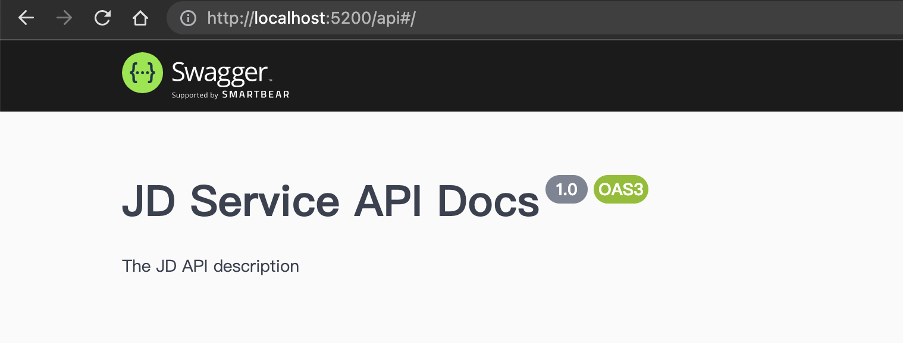
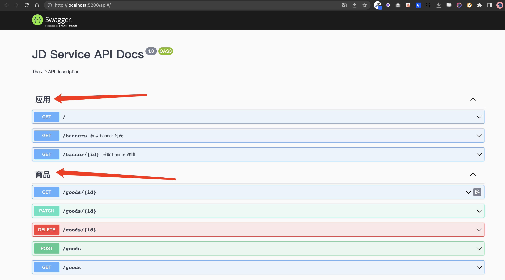
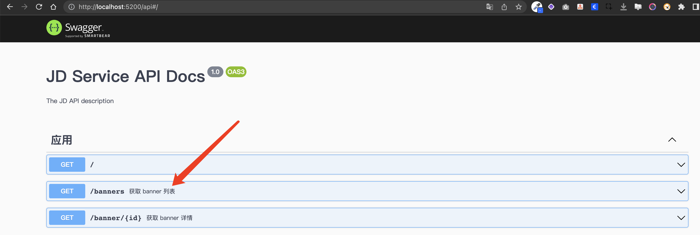
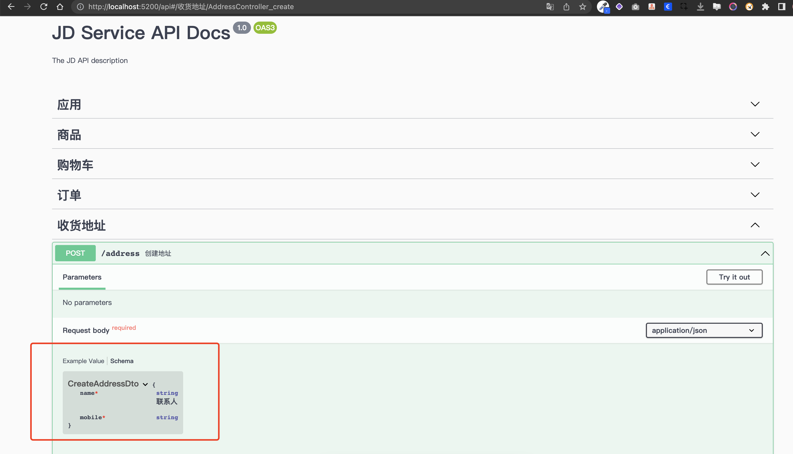
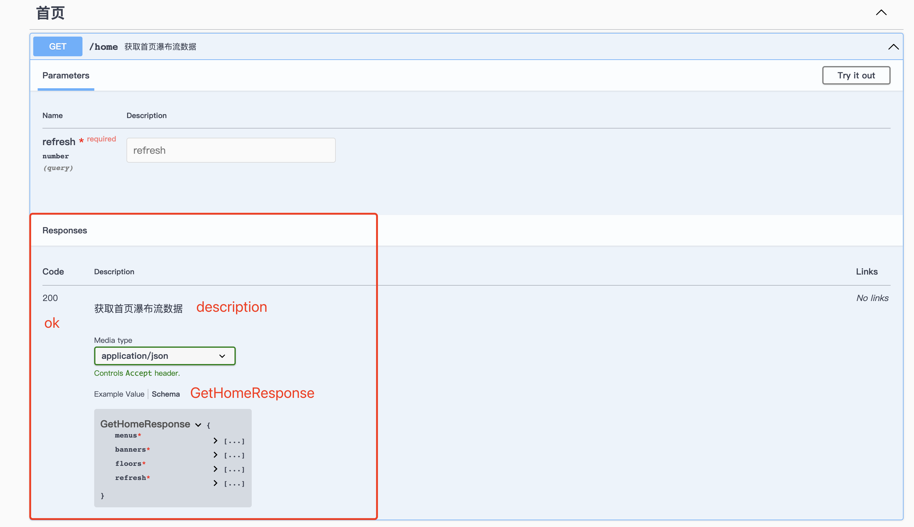

# 使用 @nestjs/swagger 搭建接口文档

nest 官方提供了 swagger 支持，通过 `@nestjs/swagger` 即可获得此能力。

## 1. 安装 `@nestjs/swagger`

在项目根目录将 `@nestjs/swagger` 安装为项目依赖：

```shell
pnpm add @nestjs/swagger
```

## 2. 使用

所有 API 均从 `@nestjs/swagger` 中引入。

### 2.1 初始化 swagger

在 src/main.ts 中加入如下内容:

```ts
import { NestFactory } from '@nestjs/core';
import { SwaggerModule, DocumentBuilder } from '@nestjs/swagger';
import { AppModule } from './app.module';

const PORT = 5200

async function bootstrap() {
  const app = await NestFactory.create(AppModule);

+  const config = new DocumentBuilder()
+   .setTitle('JD Service API Docs')
+   .setDescription('The JD API description')
+   .setVersion('1.0')
+   .build();
+  const document = SwaggerModule.createDocument(app, config);
+  SwaggerModule.setup('api', app, document);

  await app.listen(PORT);
  console.log(`your app is running at http://localhost:${PORT}`)
}
bootstrap();
```

启动服务后访问 `http://localhost:3000/api` 即可访问：



### 2.1 接口分类(标签)

```ts
@ApiTags('商品')
@Controller('goods')
export class GoodsController {}
```

效果如下：



### 2.2 接口描述

```ts
@ApiTags('应用')
@Controller()
export class AppController {
  constructor(private readonly appService: AppService) {}

  @ApiOperation({ summary: '获取 banner 列表' })
  @Get('/banners')
  getBanners(@Query() BannerQuery): Record<string, unknown> {
    return this.appService.getBanners();
  }
}
```



### 3. 参数结构及描述

定义:

```tsx
// src/address//create-address.dto.ts
import { ApiProperty } from '@nestjs/swagger'

export class CreateAddressDto {
  /**
   * 联系人
   */
  @ApiProperty({
    description: '联系人'
  })
  name: string
  /**
   * 联系电话
   */
  @ApiProperty()
  mobile: string
}
```

使用：

```ts
// src/address/address.controller
import { CreateAddressDto } from './dto/create-address.dto';

@ApiTags('收货地址')
@Controller('address')
export class AddressController {
  constructor(private readonly addressService: AddressService) {}

  @ApiOperation({ summary: '创建地址' })
  @Post()
  create(@Body() createAddressDto: CreateAddressDto) {
    return this.addressService.create(createAddressDto);
  }
}
```



### 声明响应结构及描述

使用 ApiResponse 装饰器可以声明响应结构，此外 @nestjs/swagger 中还提供了基于 ApiResponse 的封装：

- @ApiOkResponse() 状态码为 200 的正常响应
- @ApiCreatedResponse()
- @ApiAcceptedResponse()
- @ApiNoContentResponse()
- @ApiMovedPermanentlyResponse()
- @ApiFoundResponse()
- @ApiBadRequestResponse()
- @ApiUnauthorizedResponse()
- @ApiNotFoundResponse()
- @ApiForbiddenResponse()
- @ApiMethodNotAllowedResponse()
- @ApiNotAcceptableResponse()
- @ApiRequestTimeoutResponse()
- @ApiConflictResponse()
- @ApiPreconditionFailedResponse()
- @ApiTooManyRequestsResponse()
- @ApiGoneResponse()
- @ApiPayloadTooLargeResponse()
- @ApiUnsupportedMediaTypeResponse()
- @ApiUnprocessableEntityResponse()
- @ApiInternalServerErrorResponse()
- @ApiNotImplementedResponse()
- @ApiBadGatewayResponse()
- @ApiServiceUnavailableResponse()
- @ApiGatewayTimeoutResponse()
- @ApiDefaultResponse()

使用示例：

首先，我们定义了一个名为 GetHomeResponse 的 class 用于声明响应数据类型

```ts
import { ApiProperty } from '@nestjs/swagger';

export class Menu {
  @ApiProperty()
  id: string;

  @ApiProperty()
  title: string;

  @ApiProperty()
  icon: string;

  @ApiProperty()
  link: string;
}

export class GetHomeResponse {
  @ApiProperty()
  menus: Menu[];
}
```

然后在 controller 的方法添加 @ApiOkResponse 装饰器，通过 description 属性对响应结构进行描述：

```ts
@ApiTags('首页')
@Controller('home')
export class HomeController {
  constructor(private readonly homeService: HomeService) {}

  @ApiOperation({ summary: '获取首页瀑布流数据' })
  @ApiOkResponse({
    description: '获取首页瀑布流数据',
    type: GetHomeResponse,
  })
  @Get()
  findAll(@Query('refresh') refresh: 0 | 1) {
    return this.homeService.findAll(refresh);
  }
}
```

效果如下：




