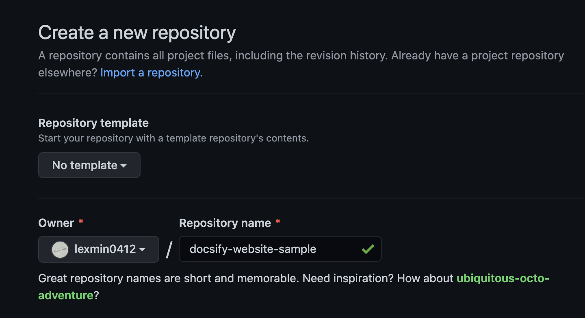
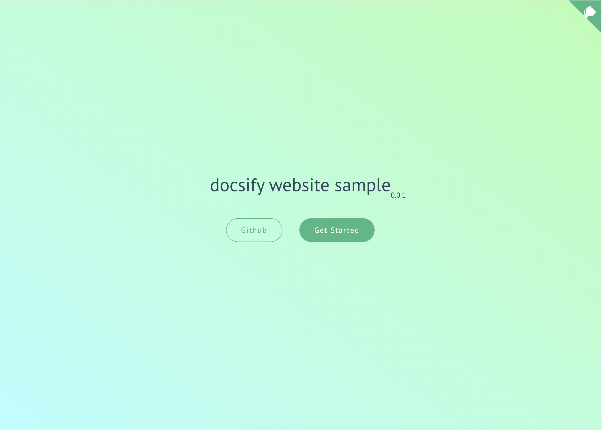
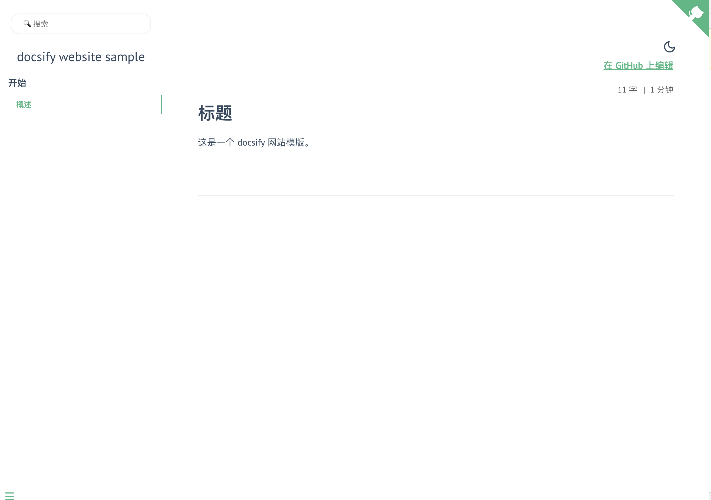
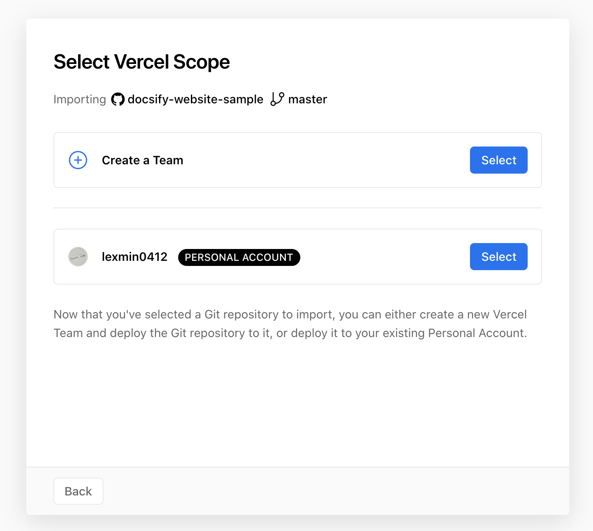
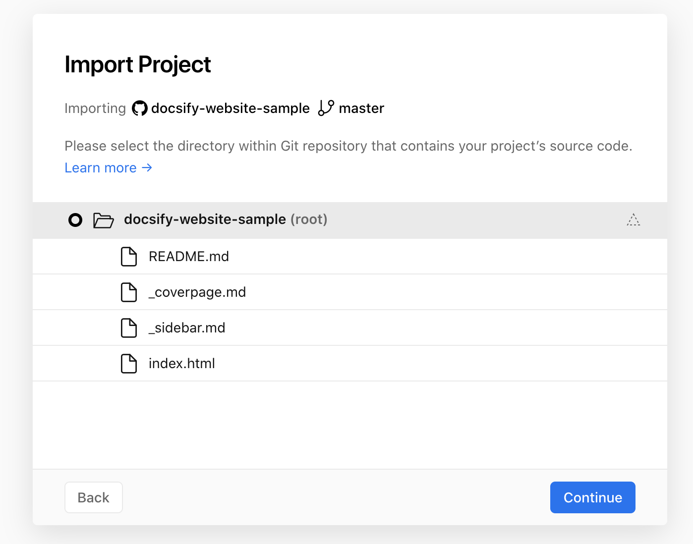
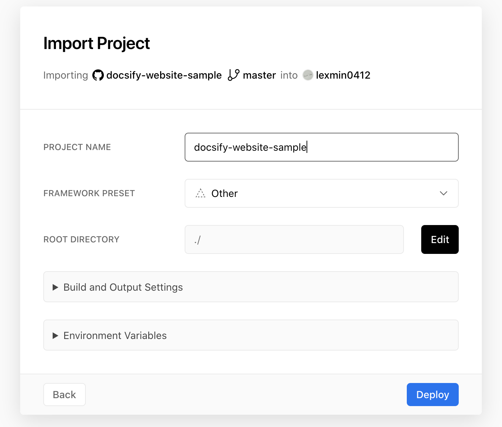
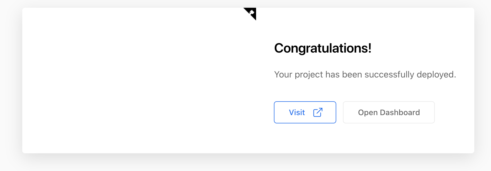
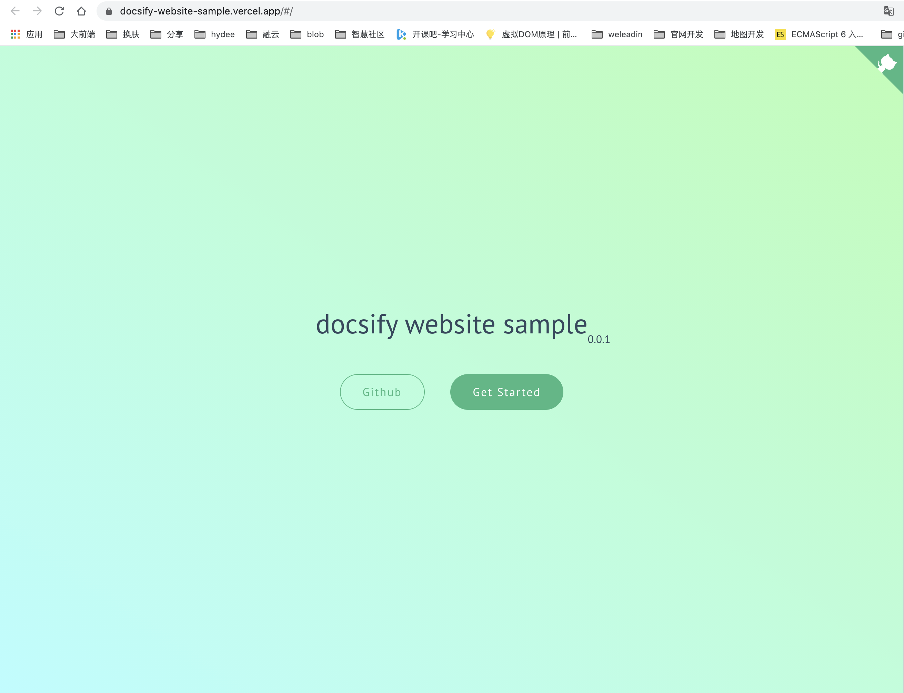
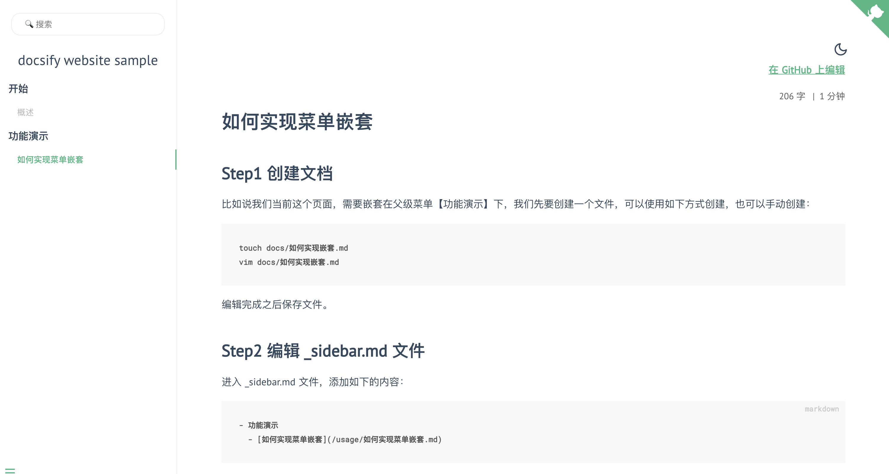

# 从 0 开始基于 docsify + vercel + github 搭建属于自己的博客

## 工具选择

### [Vercel](https://vercel.com/)

vercel 是一个出色的静态网站构建工具，它在全球都拥有 CDN 节点，因此比 Github 官方自带的 github pages 更加稳定，访问速度更快。在使用 github pages 构建静态博客时，经常会遇到提交代码，构建成功了，过了半天通过 github pages 域名访问，网站内容还是没有更新，而使用 vercel，就完全不会有这个问题。

### [Docsify](https://docsify.js.org/#/zh-cn/)

Docsify 是一个 **运行时** 的静态网站构建工具，它不会把 markdown 文件转换成 html 文件，不需要启动，不需要打包，只需要一个 index.html 和一堆 markdown 文件就可以完成你的文档网站搭建，就是这么简单。

## 准备

- 一个 github 账号
- 一个绑定了 github 的 vercel 账号，如果没有，前往 [vercel官网](https://vercel.com/) 进行注册并绑定 github。

## 开始

### 创建 github 项目



### 克隆项目到本地

```bash
git clone git@github.com:lexmin0412/docsify-website-sample.git
```

本地会生成一个名为 docsify-website-sample 的空项目。

### 搭建基础框架

在根目录分别创建以下文件：

- index.html 入口文件
- README.md 文档首页(也可以是其他名称，对应修改 _coverpage.md 中的 Get Started 链接即可)
- _coverpage.md 封面配置文件
- _sidebar.md 侧边栏配置文件

并填入对应内容：

##### index.html

```html
<!-->index.html<-->
<!DOCTYPE html>
<html lang="en">

<head>
  <meta charset="UTF-8">
  <title>docsify website sample</title>
  <link rel="shortcut icon" href="./favicon.ico" type="image/x-icon">
  <meta http-equiv="X-UA-Compatible" content="IE=edge,chrome=1" />
  <meta name="description" content="Description">
  <meta name="viewport" content="width=device-width, initial-scale=1.0, minimum-scale=1.0">
  <!-- vue主题样式 -->
  <link rel="stylesheet" href="//cdn.jsdelivr.net/npm/docsify@4/lib/themes/vue.css">
  <!-- 暗黑主题插件样式 -->
  <link rel="stylesheet" href="//cdn.jsdelivr.net/npm/docsify-darklight-theme@latest/dist/style.min.css"
    title="docsify-darklight-theme" type="text/css" />
</head>

<body>
  <div id="app">loading...</div>
  <!-- 在github上编辑插件 -->
  <script src="//cdn.jsdelivr.net/npm/docsify-edit-on-github"></script>
  <script>
    window.$docsify = {
      basePath: '/', // 资源相对路径
      name: 'docsify website sample', // 文档标题，会显示在侧边栏顶部
      nameLink: '/', // 点击文档标题后的跳转地址
      repo: 'lexmin0412/docsify-website-sample', // 有repo属性则右上角会展示github图标，点击可进入
      loadSidebar: true, // 加载侧边栏
      externalLinkTarget: '_blank', // 外部链接的打开方式，默认_blank
      cornerExternalLinkTarget: '_blank', // 右上角链接的打开方式。默认为 _blank
      routerMode: 'hash', // 路由方式 默认hash
      coverpage: true, // 展示封面
      notFoundPage: true, // 在找不到指定页面时加载_404.md
      auto2top: true, // 切换页面后是否自动跳转到页面顶部
      search: { // 搜索插件配置
        paths: 'auto',
        placeholder: '🔍 搜索',
        noData: '😞 没有结果!'
      },
      count: { // 字数统计插件配置
        countable: true,
        fontsize: '0.9em',
        color: 'rgb(90,90,90)',
        language: 'chinese'
      },
      pagination: { // 分页插件配置
        previousText: '上一章节',
        nextText: '下一章节',
        crossChapter: true,
      },
      plugins: [
        EditOnGithubPlugin.create(
          'https://github.com/lexmin0412/docsify-website-sample/blob/master/docs/',
          null,
          function ( file ) {
            if ( file.indexOf( 'en' ) === -1 ) {
              return '在 GitHub 上编辑'
            } else {
              return 'Edit on Github'
            }
          }
        )
      ],
      themeColor: "#42b983", // 暗黑模式主题色
      darklightTheme: {
        siteFont: "PT Sans",
        defaultTheme: 'dark',
        codeFontFamily: 'Roboto Mono, Monaco, courier, monospace',
        bodyFontSize: '17px',
        dark: {
          accent: '#42b983',
          toogleBackground: '#ffffff',
          background: '#091a28',
          textColor: '#b4b4b4',
          codeTextColor: '#ffffff',
          codeBackgroudColor: '#0e2233',
          borderColor: '#0d2538',
          blockQuoteColour: '#858585',
          highlightColor: '#d22778',
          sidebarSublink: '#b4b4b4',
          codeTypeColor: '#ffffff',
          coverBackground: 'linear-gradient(to left bottom, hsl(118, 100%, 85%) 0%,hsl(181, 100%, 85%) 100%)',
          toogleImage: 'url(https://cdn.jsdelivr.net/npm/docsify-darklight-theme@latest/icons/sun.svg)'
        },
        light: {
          accent: '#42b983',
          toogleBackground: '#091a28',
          background: '#ffffff',
          textColor: '#34495e',
          codeTextColor: '#525252',
          codeBackgroudColor: '#f8f8f8',
          borderColor: 'rgba(0, 0, 0, 0.07)',
          blockQuoteColor: '#858585',
          highlightColor: '#d22778',
          sidebarSublink: '#b4b4b4',
          codeTypeColor: '#091a28',
          coverBackground: 'linear-gradient(to left bottom, hsl(118, 100%, 85%) 0%,hsl(181, 100%, 85%) 100%)',
          toogleImage: 'url(https://cdn.jsdelivr.net/npm/docsify-darklight-theme@latest/icons/moon.svg)'
        }
      }
    }
  </script>
</body>

<script src="//cdn.jsdelivr.net/npm/docsify@4"></script>
<script src="//cdn.jsdelivr.net/npm/docsify/lib/plugins/search.min.js"></script>
<!--全局搜索插件-->
<script src="//unpkg.com/docsify-count/dist/countable.js"></script>
<!--字数统计插件-->
<script src="//cdn.jsdelivr.net/npm/docsify-copy-code"></script>
<!--代码段复制插件-->
<script src="//cdn.jsdelivr.net/npm/docsify/lib/plugins/zoom-image.min.js"></script>
<!--图片缩放插件-->
<script src="//unpkg.com/docsify-pagination/dist/docsify-pagination.min.js"></script>
<!-- 阅读进度条插件 -->
<script src="//cdn.jsdelivr.net/npm/docsify-darklight-theme@latest/dist/index.min.js"></script>
<!-- 暗黑主题切换插件 -->

</html>
```

##### README.md

```markdown
# 标题

这是一个 docsify 网站模版。
```

##### _coverpage.md

```markdown
# docsify website sample <small>0.0.1</small>

<a href="https://github.com/lexmin0412/docsify-website-sample">Github</a>
<a href="#README">Get Started</a>
```

##### _sidebar.md

```markdown
- 开始

  - [概述](/README.md)
```

### 本地运行

在 VSCode 中打开 index.html，右键 --> 使用 Live Server(或其他插件) 在浏览器中打开，即可看到如下的页面：



点击 Github，会跳转到我们一开始在 github 创建的项目(暂时是空的，因为我们还没有push代码)，点击 Get Started，会跳转到 _coverpage.md 中配置的页面(我们这里是README.md)。



### 配置 vercel 自动部署

通过 https://vercel.com/dashboard 进入 vercel 的工作台，会看到顶部是如下的界面：


点击右边的 New Project 按钮，会看到如下的界面：


左侧的列表中，按更新的先后顺序展示了你所有的 github 项目列表，点击刚刚创建的 docsify-website-sample 项目的 Import 按钮，进入如下界面：


选择你的个人 github 账号对应的条目，点击 Select 按钮，下一步会要求选择构建的根目录：



不用管，直接点击 Continue 按钮即可进入下一步：



直接点击 Deploy 按钮，稍等片刻，就会出现一个 Congratulations 界面：



点击 visit，vercel 已经帮你自动在 docsify-website-sample.vercel.app 这个域名下部署了项目，可以正常访问：



到这一步就算成功了，从此以后，只要你在本地对文档内容做了修改，push 到 github 之后，vercel 就会自动触发构建更新了。

你可以根据需求修改 index.html 中的内容来定制你的界面展示。

## 其他

### 菜单嵌套

#### Step1 创建文档

比如说我们有一个页面，需要嵌套在父级菜单【功能演示】下，我们先要创建一个文件，可以使用如下方式创建，也可以手动创建：

```bash
touch docs/如何实现嵌套.md

vim docs/如何实现嵌套.md
```

编辑完成之后保存文件。

#### Step2 编辑 _sidebar.md 文件

进入 _sidebar.md 文件，添加如下的内容：

```markdown
- 功能演示

  - [如何实现菜单嵌套](/usage/如何实现菜单嵌套.md)
```

现在，我们的 _sidebar 文件看起来应该是如下的样子：

```markdown
- 开始

  - [概述](/README.md)

- 功能演示

  - [如何实现嵌套](/usage/如何实现嵌套.md)
```

再打开浏览器，看到如下界面，就是我们想要的菜单嵌套效果了。

