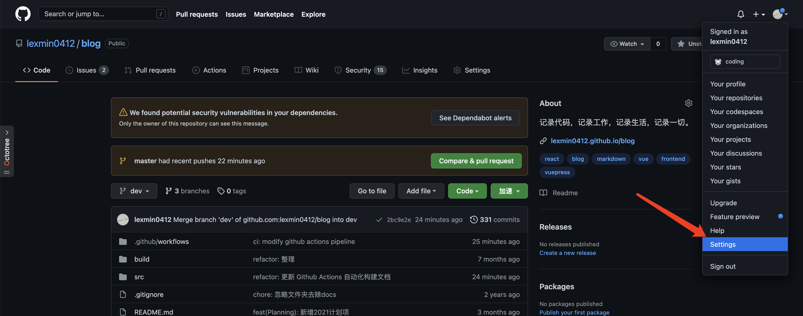
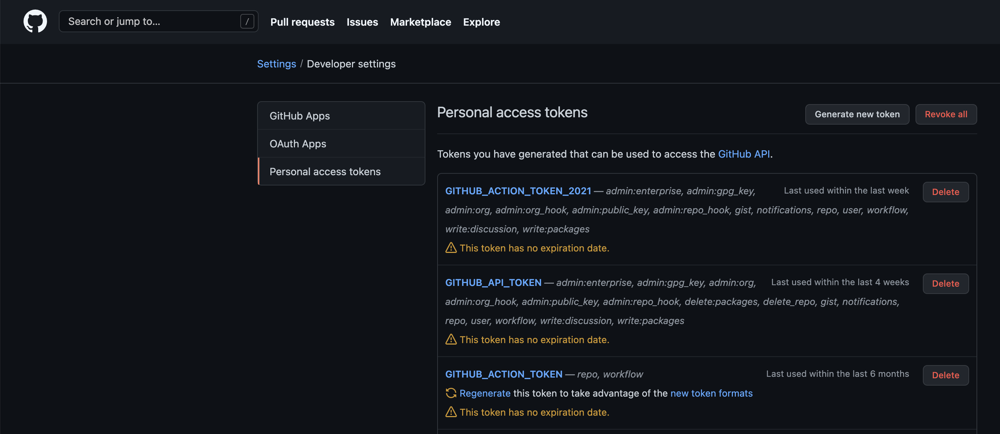
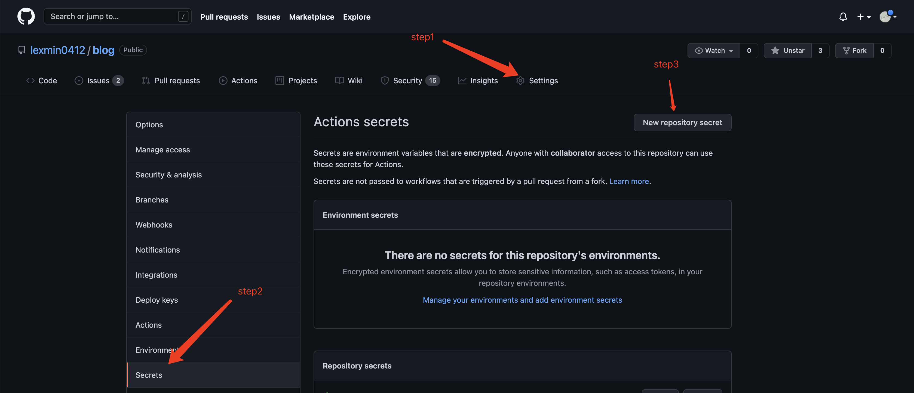
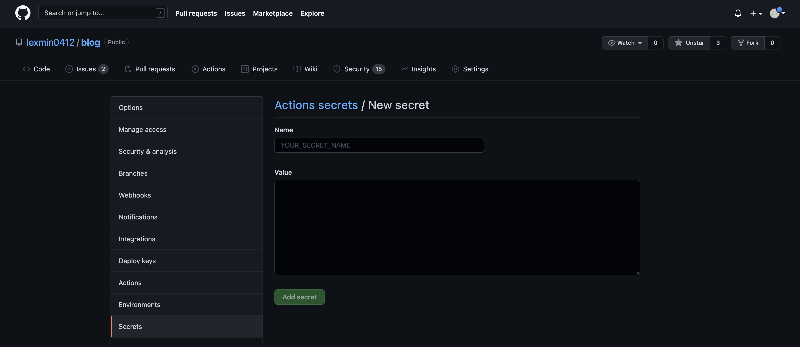
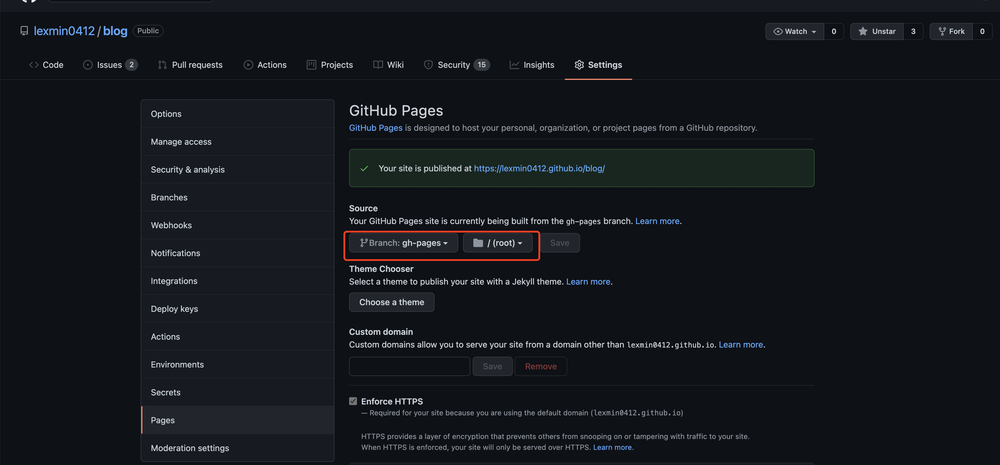
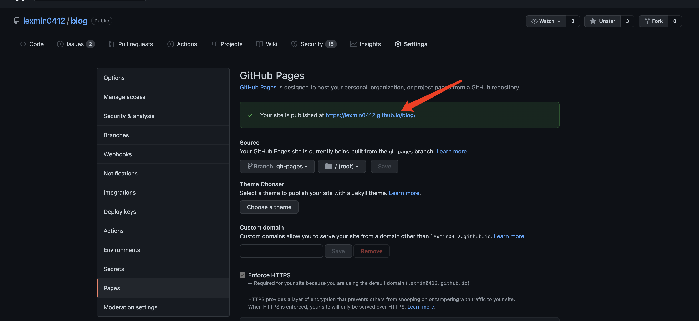
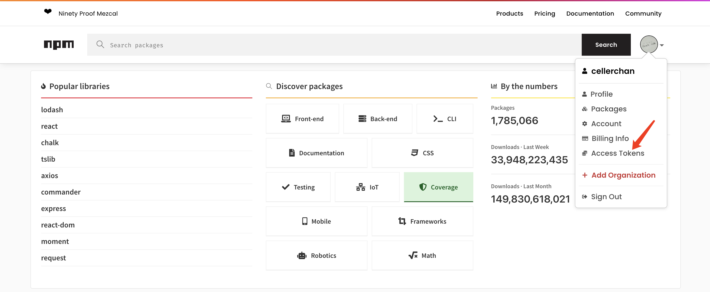
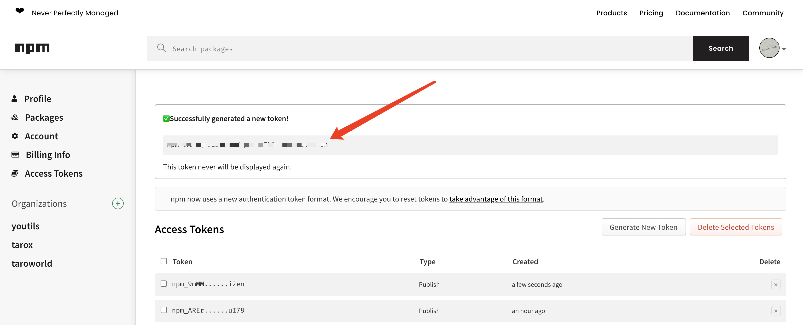

# 使用 Github Actions 实现前端应用部署及 npm 包发布自动化


当你想要在线上查看你的项目效果时，github actions 可以帮到你。

是的，就是它 ⬇️


废话不多说，我们现在就用它来创建一个属于自己的博客，并实现推送代码之后网站内容自动更新。

## 1. 获取 Personal Access Token 并设置到仓库中

### 1.1 获取 Personal Access Token





点击 Generate new token 生成一个新的 token 并复制（注意：这个 token 只会在生成成功的时候展示，一旦退出就无法再查看，所以要记得保存）。

### 1.2 给仓库添加 Secret

进入你想添加 github action 的仓库，按照如下步骤操作：



进入新建 secret 页面后，填写 Name 和 Value 字段，Name 为 ACCESS_TOKEN，Value 为刚刚保存的 Personal Access Token 值。



## 2. 添加 CI 脚本

在项目根目录下按照如下的路径创建待执行的YAML文件

```bash
mkdir .github
cd .github
mkdir workflows
cd workflows
touch nodejs.yml
```

在 `nodejs.yml` 中添加如下内容

```bash
name: 构建博客
on:
  push:  # 指定触发事件
    branches:
      - dev  # 指定触发 action 的分支

jobs:
  main:
    runs-on: ubuntu-latest
    steps:

		# 拉取github仓库代码
    - name: Checkout
      uses: actions/checkout@v2
      with:
        persist-credentials: false

		# 执行依赖安装
    - name: 安装依赖
      run: |
        npm install

		# 执行构建步骤
		- name: 构建
      run: |
			  npm run build

    # 执行部署
    - name: 部署
      uses: JamesIves/github-pages-deploy-action@releases/v3 # 这个action会根据配置自动推送代码到指定分支
      with:
        ACCESS_TOKEN: ${{ secrets.ACCESS_TOKEN }} # 指定密钥，即在第一步中设置的
        BRANCH: gh-pages  ##指定推送到的远程分支
        FOLDER: docs # 指定构建之后要推送哪个目录的代码 如这里vuepress构建之后到产物在 docs 文件夹中
```

## 3. 触发构建

提交代码到 dev 分支：

```bash
git add .
git commit -m ''
git push -u origin dev
```

此时点开对应 github 仓库的 Actions 选项卡就可以看到类似如下的构建过程：


可以看到我们在 nodejs.yml 中的定义的 push 事件被触发，执行了 jobs 中的所有步骤，打包并将打包后到 docs 文件夹中的内容推送到了 github 仓库的 gh-pages 分支。

当complete job选项完成的时候，进入仓库的 Settings => Pages 菜单下，将 source Branch 字段设置为 gh-pages，文件夹选择 root 根目录就好：



点击 Save 按钮稍等片刻，等到上面出现如下的通知表示已经构建成功：



点击链接进入即可看到自动构建完成的应用了。从此以后，你只需要推送到 yml 文件中指定的分支，就可以自动触发构建，自动更新你的网站了。

## 4. 扩展应用 - 自动发布 NPM 包

npm 发布其实跟上面的路程并无两样，只是第一步中要获取和设置的 github ACCESS_TOKEN 变成了 npm 的 ACCESS_TOKEN，第二步中的部署 github pages 脚本变成了 npm 发布脚本。

### 4.1 获取 npm access token 并设置到仓库

进入 [npm 官网](https://www.npmjs.com/) 并登录账号，然后点击右上角头像，点击 Access Tokens 进入 token 管理：



点击 Generate New Token：


出现如下的界面：


因为我们是需要用到 token 去发布 npm 包，所以这里要选择 Publish 类型，然后点击 Generate Token 按钮，Token 就生成了：



点击 Token 即可复制到剪贴板（注意这里的 Token 同样只会出现一次，记得保存到安全的地方）。

然后进入 Github 中的仓库设置，和第一步中设置 Access Token 的步骤一样，添加一个 key 为 `NPM_TOKEN` ，值为刚刚获取到的 npm access token 的 secret。

### 4.2 添加 npm 自动发包脚本

上面有说到，部署应用和发布 npm 包的区别只在于最后的一部分，我们将脚本稍作修改，将 `执行部署` 步骤改成 `npm 发布` 即可。

```bash
name: 构建博客
on:
  push:  # 指定触发事件
    branches:
      - dev  # 指定触发 action 的分支

jobs:
  main:
    runs-on: ubuntu-latest
    steps:

		# 拉取github仓库代码
    - name: Checkout
      uses: actions/checkout@v2
      with:
        persist-credentials: false

		# 执行依赖安装
    - name: 安装依赖
      run: |
        npm install

		# 执行构建步骤
		- name: 构建
      run: |
			  npm run build

    # 执行部署
    - name: 发布到 NPM
      uses: actions/setup-node@v1
        with:
          node-version: 12
          registry-url: https://registry.npmjs.org/  # 设置发包npm地址仓库
      - run: npm publish # 执行发布
        env:
          NODE_AUTH_TOKEN: ${{secrets.NPM_TOKEN}} # 刚刚设置的 NPM_TOKEN
```

### 参考资料

- [github action](https://help.github.com/cn/articles/configuring-a-workflow)
- [GitHub 操作的工作流程语法](https://help.github.com/cn/articles/workflow-syntax-for-github-actions)
